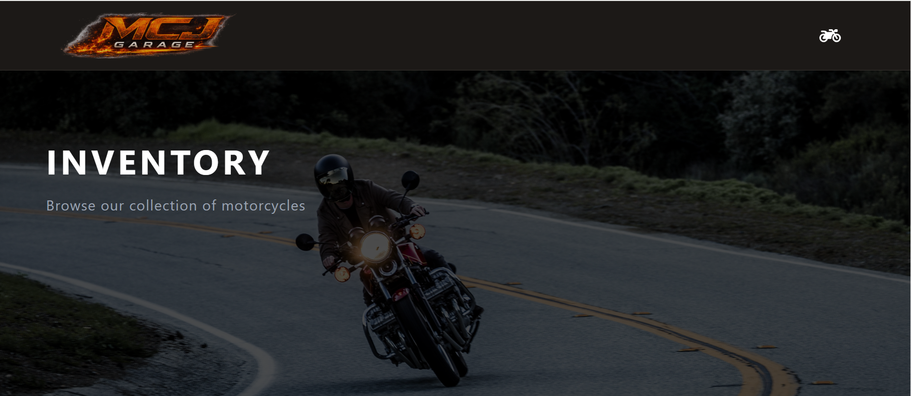

  <section>
  <h2>🏍️ MCJ GARAGE – Vintage Motorcycle E-Commerce</h2>
    
  

    <strong>MCJ Garage</strong> es una aplicación web de tipo <strong>e-commerce</strong> 
    desarrollada con React, orientada a la compra de motocicletas vintage, servicios de taller 
    y piezas personalizadas. Permite explorar el catálogo, ver el detalle de cada moto, 
    agendar servicios y gestionar un carrito de compras con confirmación vía WhatsApp.
  

  

  <h3>🌐 Visita el sitio:</h3>
  

    [https://mgc-garage.vercel.app/]
  

  <h3>📂 Código fuente</h3>
  

    (https://github.com/violetaatkinson/MGC-Garage)
  

  

  <h3>✨ Características principales</h3>
  <ul>
    <li>🏍️ Catálogo de motos vintage con detalle por unidad</li>
    <li>🛒 Carrito de compras con servicios y productos</li>
    <li>🔧 Agendado de servicios mecánicos con selección múltiple</li>
    <li>📦 Gestión de órdenes guardadas en Firebase Firestore</li>
    <li>💬 Confirmación de compra vía WhatsApp con resumen del pedido</li>
    <li>🔔 Notificaciones interactivas con SweetAlert2</li>
    <li>🎨 Interfaz moderna, oscura y responsive</li>
    <li>🔁 Navegación dinámica sin recarga (SPA)</li>
    <li>🔒 Estado global del carrito con Context API</li>
  </ul>

  

  <h3>🛠️ Tecnologías utilizadas</h3>
  <ul>
    <li>React 18</li>
    <li>React Router DOM</li>
    <li>JavaScript ES6+ (arrow functions, async/await, spread, destructuring)</li>
    <li>JSX y Virtual DOM</li>
    <li>Hooks: useState, useEffect, useContext, useParams, useNavigate, useLocation</li>
    <li>Context API</li>
    <li>Firebase Firestore</li>
    <li>Tailwind CSS</li>
    <li>SweetAlert2</li>
    <li>MockAPI (fallback de datos)</li>
    <li>Cloudinary (hosting de imágenes)</li>
    <li>Vite</li>
  </ul>

  

  <h3>📚 Conceptos aplicados del curso</h3>
  <ul>
    <li>📦 <strong>Unidad 1 – Entorno React + Vite:</strong> Configuración base del proyecto</li>
    <li>🧩 <strong>Unidad 2 – JSX y Componentes:</strong> Arquitectura Container/Presentacional en cada sección</li>
    <li>⚡ <strong>Unidad 3 – Promises, asincronía y MAP:</strong> Fetch a Firestore y MockAPI, renderizado dinámico del catálogo</li>
    <li>🪝 <strong>Unidad 4 – Hooks y Patrones:</strong> useState, useEffect, useContext en Cart, Motos y Contact</li>
    <li>🗺️ <strong>Unidad 5 – Routing y navegación:</strong> React Router con rutas dinámicas <code>/moto/:id</code> y navegación sin recarga</li>
    <li>🔀 <strong>Unidad 6 – Context y rendering condicional:</strong> CartContext global, estados de carrito vacío, loading y confirmación</li>
    <li>🔥 <strong>Unidad 7 – Firebase:</strong> Firestore para productos y órdenes, con fallback a MockAPI</li>
    <li>🏁 <strong>Unidad 8 – Integración final:</strong> E-commerce completo con flujo de compra end-to-end</li>
  </ul>

  

  <h3>✨ Objetivo del proyecto</h3>
  

    Desarrollar el front-end completo de un e-commerce real aplicando los conceptos 
    fundamentales de React: componentización, hooks, Context API, consumo de datos 
    externos con Firestore y renderizado condicional, con foco en la experiencia de 
    usuario y el diseño visual.
  

  

  <h3>👩‍💻 Autora</h3>
  

    <strong>Violeta Atkinson</strong> 
    Proyecto final desarrollado durante el curso <strong>React JS - CoderHouse</strong>
  

</section>
